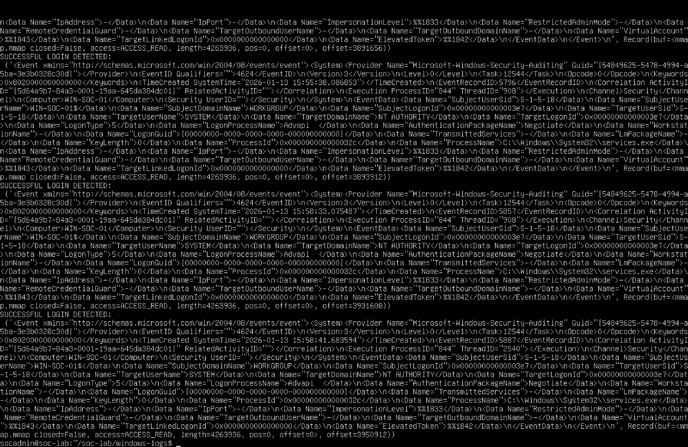
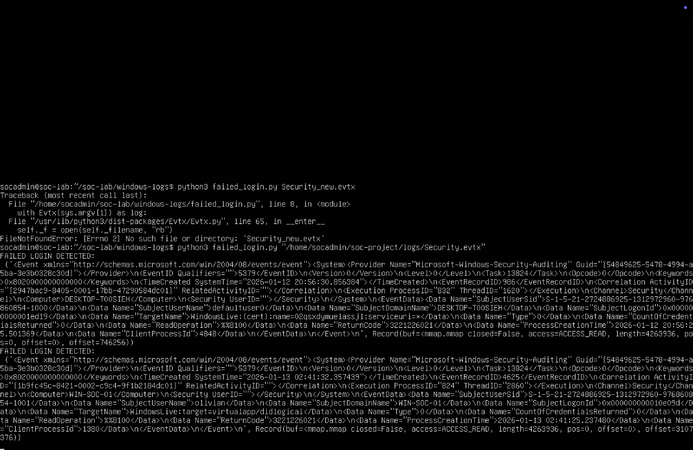

# windows-evtx-authentication-analysis
Python-based analysis of Windows EVTX logs to detect successful and failed login attempts (Event ID 4624 &amp; 4625)
Windows EVTX Authentication Log Analysis

# Windows EVTX Authentication Log Analysis

## Overview
This project analyses Windows Security Event Logs (EVTX) using Python to identify authentication activity. It detects both successful and failed login attempts by parsing Event IDs.

## Objectives
- Parse EVTX log files using Python
- Detect successful logins (Event ID 4624)
- Detect failed login attempts (Event ID 4625)
- Summarise authentication activity

## Tools Used
- Python 3
- python-evtx library
- Ubuntu (UTM)
- Windows Event Viewer

## How It Works
The script reads a Windows Security.evtx file and searches for specific Event IDs:
- 4624 → Successful login
- 4625 → Failed login

It then:
- Counts total successful logins
- Counts failed login attempts
- Displays detected failed login events

## Script

```python
from Evtx.Evtx import Evtx
from Evtx.Views import evtx_file_xml_view
import sys

success = 0
failed = 0

with Evtx(sys.argv[1]) as log:
    for record in evtx_file_xml_view(log):
        data = str(record)

        if "4624" in data:
            success += 1

        elif "4625" in data:
            failed += 1
            print("\nFAILED LOGIN DETECTED:\n", data)

print("\nSUMMARY:")
print("Successful logins (4624):", success)
print("Failed logins (4625):", failed)
```
## Screenshots
### successful login detection
 

### failed login detection


### login summary

## Key Learning
- Understanding Windows Event Logs (EVTX)
- Identifying authentication-related events
- Basic security monitoring using Python
- Differentiating normal vs suspicious activity

## Future Improvements
- Extract usernames and IP addresses
- Export results to CSV
- Visualise login activity
